<h2 align="center">Figure Simulations</h2>

This page provides movie versions of the simulations illustrated for Figures 4, 5, and 6. The movies are not embedded. Each section shows the reconstructed SPN morphology and paired control / M1 activation still images; click each still image to download the linked MP4 movie.

### Figure 4

<h3 align="center">Dendritic voltage in an iSPN with fast synaptic GABAergic input and subthreshold clustered glutamatergic input</h3>

  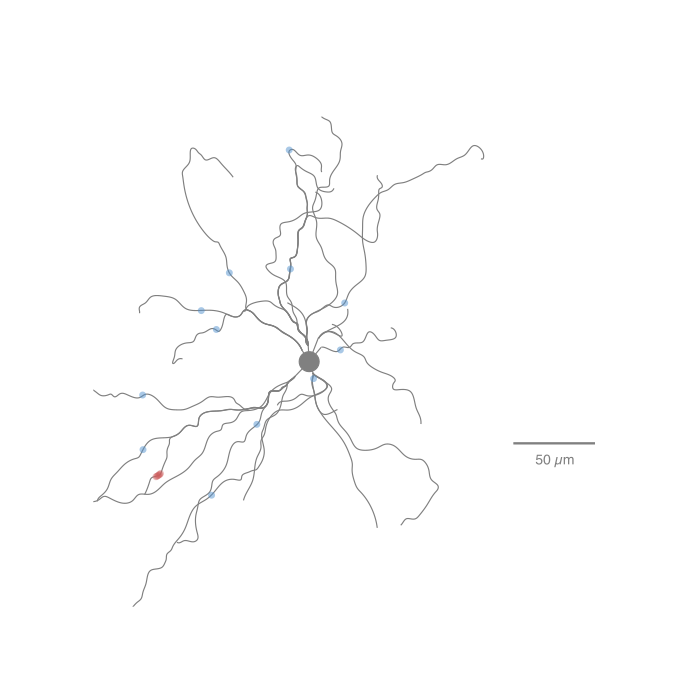

  

    
control

    <a href="https://github.com/vernonclarke/msNEURON_Belal2026/raw/main/animations/iSPN_22513_Vdend_anim_1000.mp4?download=">
      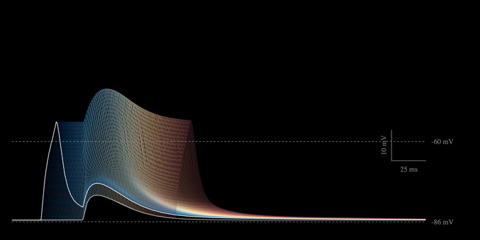
    </a>
  

  

    
M1 activation

    <a href="https://github.com/vernonclarke/msNEURON_Belal2026/raw/main/animations/iSPN_2257_Vdend_anim_1000.mp4?download=">
      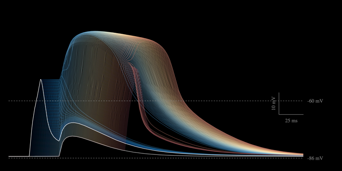
    </a>
  

<h3 align="center">Dendritic voltage in an iSPN with slow extrasynaptic GABAergic input and subthreshold clustered glutamatergic input</h3>

  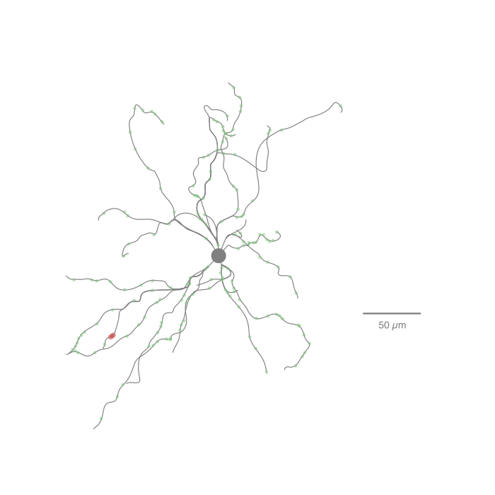

  

    
control

    <a href="https://github.com/vernonclarke/msNEURON_Belal2026/raw/main/animations/iSPN_22713_Vdend_anim_1000.mp4?download=">
      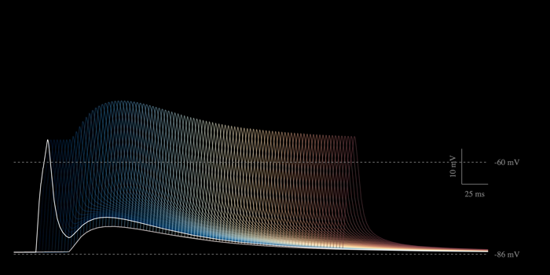
    </a>
  

  

    
M1 activation

    <a href="https://github.com/vernonclarke/msNEURON_Belal2026/raw/main/animations/iSPN_2277_Vdend_anim_1000.mp4?download=">
      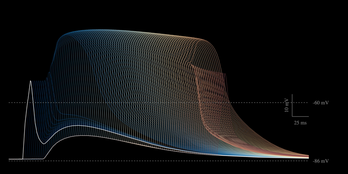
    </a>
  

### Figure 5

<h3 align="center">Somatic voltage in an iSPN with fast synaptic GABAergic input and suprathreshold clustered glutamatergic input</h3>

  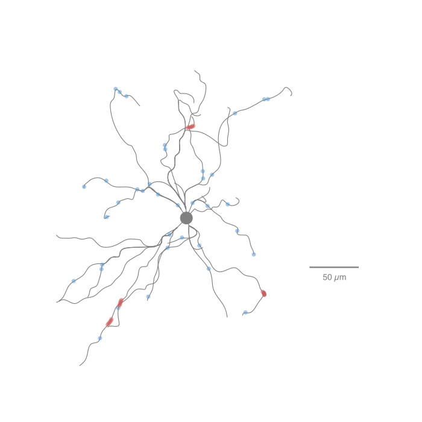

  

    
control

    <a href="https://github.com/vernonclarke/msNEURON_Belal2026/raw/main/animations/iSPN_2811_Vsoma_anim_1000.mp4?download=">
      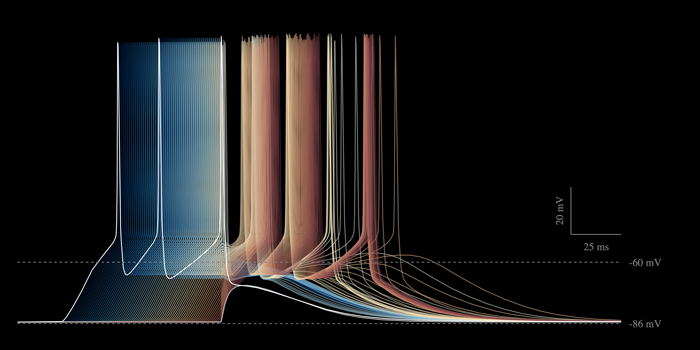
    </a>
  

  

    
M1 activation

    <a href="https://github.com/vernonclarke/msNEURON_Belal2026/raw/main/animations/iSPN_2819_Vsoma_anim_1000.mp4?download=">
      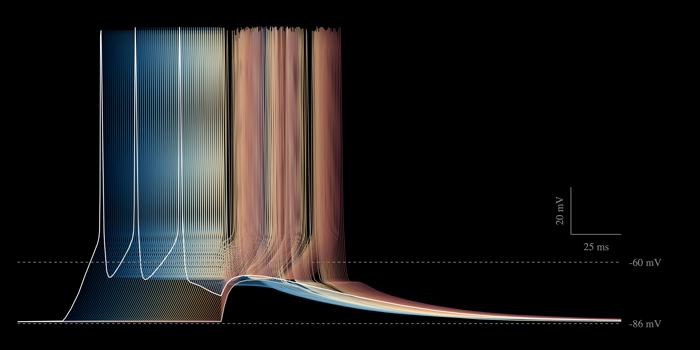
    </a>
  

<h3 align="center">Somatic voltage in an iSPN with slow extrasynaptic GABAergic input and suprathreshold clustered glutamatergic input</h3>

  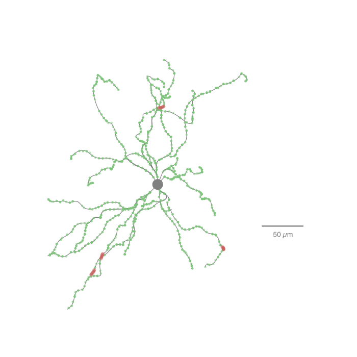

  

    
control

    <a href="https://github.com/vernonclarke/msNEURON_Belal2026/raw/main/animations/iSPN_2911_Vsoma_anim_1000.mp4?download=">
      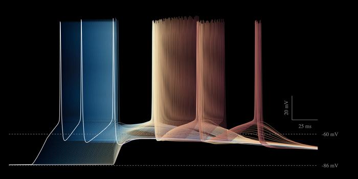
    </a>
  

  

    
M1 activation

    <a href="https://github.com/vernonclarke/msNEURON_Belal2026/raw/main/animations/iSPN_2919_Vsoma_anim_1000.mp4?download=">
      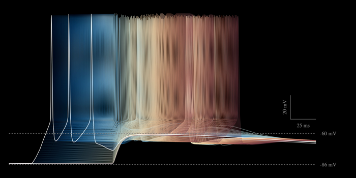
    </a>
  

### Figure 6

<h3 align="center">Dendritic voltage in a dSPN with slow extrasynaptic GABAergic input and subthreshold clustered glutamatergic input</h3>

  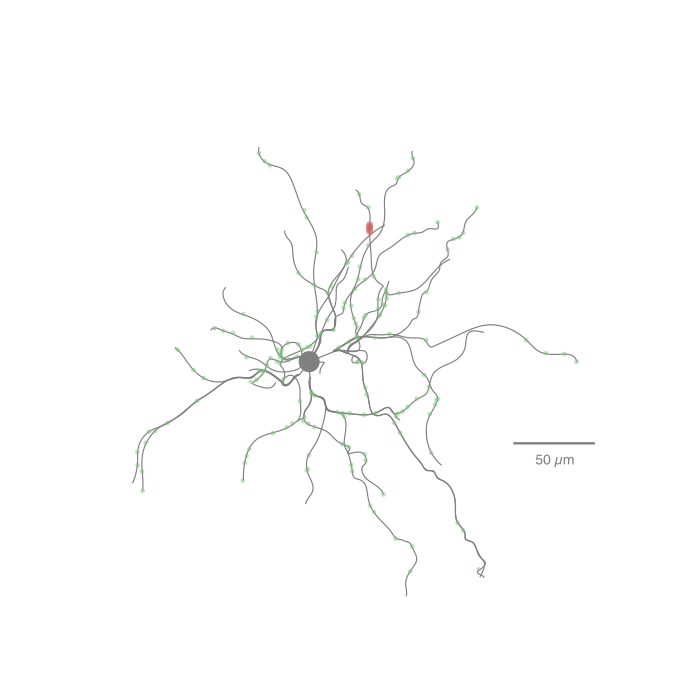

  

    
control

    
  

  

    
M1 activation

    <a href="https://github.com/vernonclarke/msNEURON_Belal2026/raw/main/animations/dSPN_2277_Vdend_anim_1000.mp4?download=">
      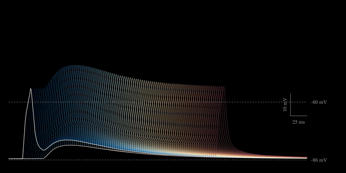
    </a>
  

<h3 align="center">Somatic voltage in a dSPN with slow extrasynaptic GABAergic input and suprathreshold clustered glutamatergic input</h3>

  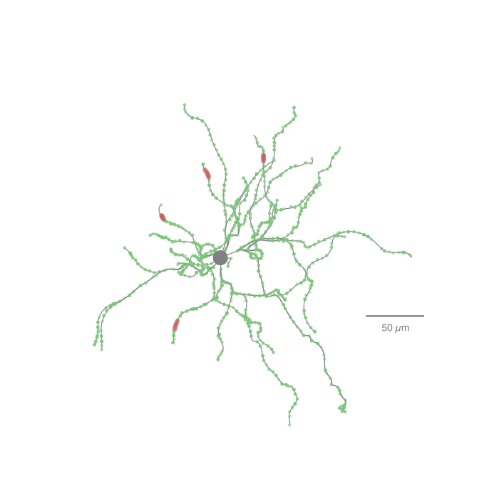

  

    
control

    <a href="https://github.com/vernonclarke/msNEURON_Belal2026/raw/main/animations/dSPN_2911_Vsoma_anim_1000.mp4?download=">
      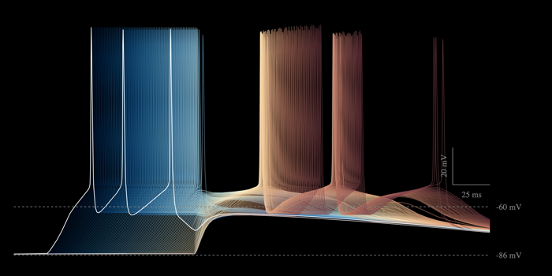
    </a>
  

  

    
M1 activation

    <a href="https://github.com/vernonclarke/msNEURON_Belal2026/raw/main/animations/dSPN_2913_Vsoma_anim_1000.mp4?download=">
      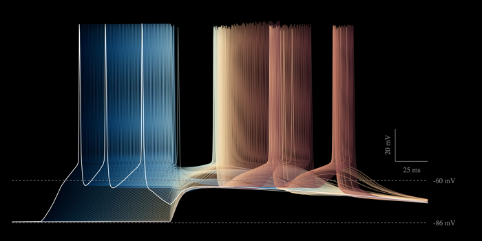
    </a>
  

